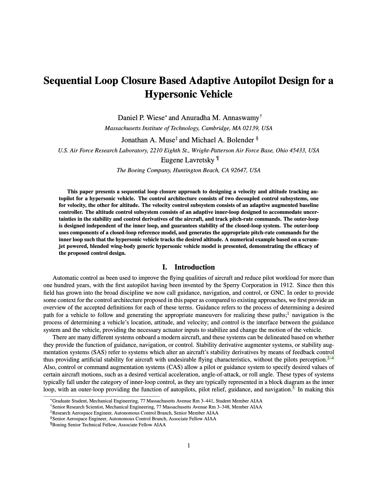

# AIAA GNC 2016: Sequential Loop Closure Based Adaptive Autopilot Design for a Hypersonic Vehicle


<p align="center">
  
</p>

## Generating Output

```sh
# To make generate the PDF from source
make pdf

# To clean temporary and output files
make clean
```
